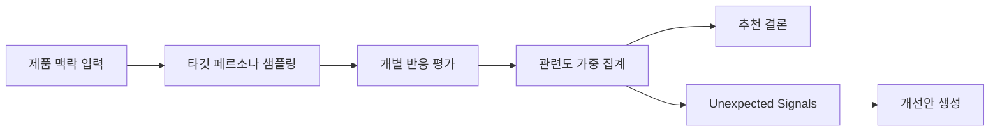

# Persona Signal

**Persona-based decision support for product teams**

Persona Signal은 제품팀이 출시 직전 내리는 메시지, 가격, 기능 결정을 타깃 사용자 관점으로 사전 검토하게 해주는 pre-validation tool입니다. 실제 리서치를 대체하지 않지만, 감에 의존한 결정을 줄이고 출시 전 리스크를 먼저 드러냅니다.

AI로 제품을 만드는 속도는 빨라졌지만, 무엇을 내보내야 하는지에 대한 판단은 여전히 팀의 감에 크게 의존합니다. Persona Signal은 그 사이의 공백을 메웁니다.

> 우리는 정답을 예측하지 않습니다. 대신 출시 전에 실패할 가능성이 높은 안을 더 빨리 걸러냅니다.

## 1. 제품 정의

**Persona Signal은 제품팀이 출시 직전 내리는 메시지, 가격, 기능 결정을 타깃 사용자 관점으로 사전 검토하게 해주는 persona-based decision support SaaS입니다.**

제품팀은 매번 리서치나 A/B 테스트를 할 수 없습니다. 그렇다고 모든 결정을 내부 회의와 직감만으로 정하는 것도 위험합니다. Persona Signal은 이 중간 지점에서 빠르게 리스크를 확인하고, 더 나은 후보안으로 수정하게 돕습니다.

## 2. 개발 목적

제품 실패는 큰 전략 실수보다, 반복적으로 누적되는 고영향 의사결정에서 시작되는 경우가 많습니다.

- 이 헤드라인이 고객에게 바로 이해될까?
- 이 가격이 합리적으로 느껴질까?
- 이 기능이 정말 필요한가, 아니면 nice-to-have인가?
- 이 전환 문구가 구매를 만들까, 압박감과 CS 문의를 만들까?
- 이 설명은 실사용자는 좋아해도 구매자나 승인권자가 막지 않을까?

이런 결정은 출시 직전 자주 발생하지만, 대부분 충분한 사용자 검증 없이 정해집니다. Persona Signal은 제품팀이 배포 전에 타깃 관점의 구조화된 반응을 확인하게 해, 메시지 혼란, 신뢰 저하, 행동 저항, 세그먼트별 거부 신호를 먼저 발견하게 합니다.

## 3. 목표

| 의사결정 | Persona Signal이 확인하는 것 |
| --- | --- |
| 랜딩 메시지 | 사용자가 바로 이해하는가, 신뢰할 근거가 있는가 |
| 가격/플랜 | 체감가치와 지불의향이 맞는가, 비용 불안이 생기지 않는가 |
| 기능 우선순위 | 실제 필요도와 긴급성이 있는가, 대체재가 이미 있는가 |
| 온보딩/전환 문구 | 행동을 만들 만큼 명확한가, 압박감이나 불신을 만들지 않는가 |
| B2B 구매 맥락 | 실사용자와 구매자가 서로 다른 근거를 필요로 하지 않는가 |

Persona Signal의 목표는 "좋아 보이는 안"을 고르는 것이 아닙니다. 출시 후 문제를 만들 가능성이 높은 안을 먼저 걸러내고, 더 나은 수정 방향을 제안하는 것입니다.

## 4. 일반 AI 채팅과 다른 점

Persona Signal은 의견을 주는 AI가 아니라, 평균 점수 뒤에 숨은 리스크를 잡아내는 의사결정 레이어입니다.

| 일반 AI 채팅 | Persona Signal |
| --- | --- |
| 한 번의 일반적인 의견을 생성합니다. | 여러 타깃 페르소나의 반응을 구조화해 비교합니다. |
| 프롬프트 품질에 결과가 크게 흔들립니다. | 제품 맥락, 타깃, 시장 유형, 사용/구매 맥락을 고정 입력으로 받습니다. |
| 평균적인 조언에 머물기 쉽습니다. | 세그먼트별 차이와 숨은 리스크를 분리해 보여줍니다. |
| "더 좋게 써줘"로 끝나기 쉽습니다. | 발견된 리스크를 반영한 개선안 3개를 생성합니다. |
| 승자 선택에 집중합니다. | 왜 출시 후 실패할 수 있는지까지 설명합니다. |



## 5. Unexpected Signals

Persona Signal의 핵심은 평균 점수로는 보이지 않는 **놓치기 쉬운 신호**를 드러내는 것입니다.

| 신호 | 의미 |
| --- | --- |
| 구매자-사용자 불일치 | 실사용자는 좋아하지만 구매자나 승인권자가 신뢰하지 않는 경우 |
| 신뢰 갭 | 흥미는 높지만 보안, 가격, 근거 부족 때문에 행동으로 이어지지 않는 경우 |
| 명확하지만 행동 안 함 | 이해는 되지만 필요성이나 긴급성이 부족한 경우 |
| 숨은 이탈 세그먼트 | 전체 평균은 괜찮지만 특정 세그먼트가 강하게 거부하는 경우 |
| 비타깃 평균 희석 | broad audience 평균은 낮지만 실제 타깃에서는 강하게 반응하는 경우 |
| 근소한 승리 | 승자는 있지만 바로 배포할 만큼 압도적이지 않은 경우 |

예를 들어 B2B SaaS 랜딩에서는 실사용자가 "CRM 업데이트 시간을 줄인다"는 메시지를 좋아할 수 있습니다. 하지만 실제 구매 승인자는 고객 대화 데이터의 보관, 삭제, 접근 권한을 먼저 확인합니다. Persona Signal은 이런 차이를 결과 상단에 드러냅니다.

### 시뮬레이션 평가 방식

평가는 모든 지표가 높을수록 좋은 방향으로 읽히도록 정리했습니다.

| 공통 축 | 질문 |
| --- | --- |
| 이해도 | 무엇을 말하는지 바로 이해되는가 |
| 신뢰도 | 과장 없이 믿을 만한가 |
| 매력도 | 나에게 필요하거나 끌리는가 |
| 수용도 | 거부감이나 행동 저항이 낮은가 |

타입별로는 한 단계 더 깊게 봅니다.

| 입력 타입 | 추가로 보는 신호 |
| --- | --- |
| 메시지 | 기억성, 헷갈리는 표현, 설득 포인트 |
| 가격 | 체감가치, 부담도, 지불의향 |
| 기능 | 필요도, 긴급성, 대체재 인식 |

페르소나는 비판적인 평가자가 아니라 실제 타깃 사용자처럼 반응하도록 설계했습니다. 먼저 각 안을 단독으로 평가하고, 그 다음에 비교 선택을 하도록 해 후광효과를 줄입니다. 관련도가 낮은 페르소나는 제외하지 않고 낮은 가중치로 반영해, 표본이 지나치게 예뻐지는 문제도 피했습니다.

## 6. 데모 시나리오

데모는 실제 제품팀 회의에서 나올 법한 안건으로 구성했습니다.

| 데모 | 도메인 | 보여주는 핵심 가치 |
| --- | --- | --- |
| 보안이 막는 SaaS 랜딩 | B2B SaaS | 사용자 매력과 구매자 신뢰 리스크의 분리 |
| 다음 스프린트 기능 | B2B 기능 우선순위 | nice-to-have와 must-have의 차이 |
| D2C SaaS 가격표 | 커머스/구독 | 낮아 보이는 가격이 오히려 비용 불안을 만들 수 있음 |
| 무료체험 종료 모달 | 구독 전환 | 전환 압박과 CS 리스크의 균형 |
| 학부모 결제 앱 | 교육 | 사용자와 구매자가 다른 근거를 필요로 함 |
| 계좌 연결 첫 화면 | 핀테크 | 관심은 높지만 데이터 접근 불안이 행동을 막음 |

추천 데모 흐름:

1. **보안이 막는 SaaS 랜딩**: user와 buyer가 다르게 반응하는 장면을 보여줍니다.
2. **무료체험 종료 모달**: 전환율을 높이려는 문구가 압박감과 CS 리스크를 만들 수 있음을 보여줍니다.
3. **계좌 연결 첫 화면**: 명확하고 매력적인 메시지도 신뢰 장벽을 넘지 못하면 행동으로 이어지지 않음을 보여줍니다.

## 7. 기술 구조와 실행

```text
.
├── README.md
├── app/                    # Next.js App Router
├── components/             # 랜딩, 입력 플로우, 결과 UI
├── data/                   # 데모 시나리오와 데모 응답
├── lib/                    # 샘플링, 프롬프트, LLM, 요약 로직
├── supabase/migrations/    # personas 테이블 스키마
└── scripts/prepare_personas.py
```

| 영역 | 구현 |
| --- | --- |
| Frontend | Next.js App Router, React, Tailwind CSS, Recharts, Three.js |
| Backend | Next.js Route Handler, Zod validation |
| AI | OpenAI `gpt-4o-mini`, 페르소나별 병렬 평가, 요약/개선안 생성 |
| Data | Supabase PostgreSQL, NVIDIA Nemotron-Personas-Korea 기반 5,000개 한국어 페르소나 |

실행 방법:

```bash
npm install
npm run dev
```

검증:

```bash
npm run lint
npm run build
```

필요한 환경변수:

```bash
SUPABASE_URL=
SUPABASE_ANON_KEY=
SUPABASE_SERVICE_KEY=
NEXT_PUBLIC_SUPABASE_URL=
NEXT_PUBLIC_SUPABASE_ANON_KEY=
OPENAI_API_KEY=
OPENAI_MODEL=gpt-4o-mini
```

## 8. 한계와 올바른 사용법

Persona Signal은 실제 유저 리서치나 A/B 테스트를 대체하지 않습니다.

- 합성 페르소나 반응은 실제 사용자 행동이 아닙니다.
- 점수는 통계적 진실이 아니라 방향성 신호로 읽어야 합니다.
- 작은 표본은 확정 판단보다 리스크 탐지에 적합합니다.
- LLM 출력은 실행마다 달라질 수 있습니다.
- 페르소나 데이터에는 데이터셋 편향이 포함될 수 있습니다.

사용 방식은 간단합니다.

1. Persona Signal로 출시 전 리스크를 빠르게 발견합니다.
2. 더 나은 후보안을 만듭니다.
3. 실제 유저 인터뷰, 분석 데이터, A/B 테스트로 최종 검증합니다.

## 부록.

Persona Signal은 제품팀이 출시 직전 내리는 메시지, 가격, 기능 결정을 타깃 사용자 관점으로 사전 검토하게 해주는 pre-validation tool입니다. 실제 리서치를 대체하지는 않지만, 감에 의존한 결정을 줄이고 출시 후 문제가 될 리스크를 먼저 드러냅니다. 특히 평균 점수 뒤에 숨은 구매자-사용자 불일치, 신뢰 갭, 숨은 이탈 세그먼트를 별도로 보여줍니다.


제품팀은 매주 메시지, 가격, 기능 우선순위 같은 고영향 의사결정을 내립니다. 하지만 초기 팀은 모든 결정마다 인터뷰나 A/B 테스트를 할 수 없기 때문에, 많은 결정이 내부 감으로 정해집니다.

Persona Signal은 이 지점에 들어갑니다. 제품 맥락과 타깃을 입력하면, 한국어 페르소나 샘플이 각 안을 실제 사용자 관점으로 평가하고, 이해도, 신뢰도, 매력도, 수용도, 타입별 지표를 구조화해 보여줍니다.

중요한 점은 승자를 맞추는 것이 아닙니다. Persona Signal은 평균 점수만 보여주지 않고, 구매자는 신뢰하지 않지만 실사용자는 좋아하는 경우, 흥미는 높지만 행동으로 이어지지 않는 경우, 특정 세그먼트만 강하게 거부하는 경우를 Unexpected Signals로 분리합니다.

결과는 추천 결론, 핵심 리스크, 세그먼트 차이, 페르소나 반응, 개선안 3개로 이어집니다. 제품팀은 이 결과를 보고 바로 문구나 가격안, 기능 설명을 수정한 뒤 실제 실험으로 넘길 수 있습니다.


먼저 "보안이 막는 SaaS 랜딩" 데모를 보겠습니다. A안은 CRM 업데이트 시간을 줄인다는 생산성 메시지이고, B안은 민감한 고객 대화를 보호한다는 신뢰 메시지입니다.

결과에서 중요한 건 단순히 B가 이긴다는 점이 아닙니다. 실사용자는 자동화와 시간 절약을 좋아하지만, 구매 승인자는 고객 대화 데이터의 보관, 삭제, 접근 권한을 먼저 확인합니다. Persona Signal은 이 buyer-user mismatch를 별도 신호로 보여주고, CTA 앞에 보안 근거를 보강하라는 수정 방향까지 제안합니다.

이것이 Persona Signal의 핵심입니다. 우리는 더 그럴듯한 문장을 만드는 것이 아니라, 출시 후 막힐 가능성이 높은 지점을 먼저 찾습니다.
